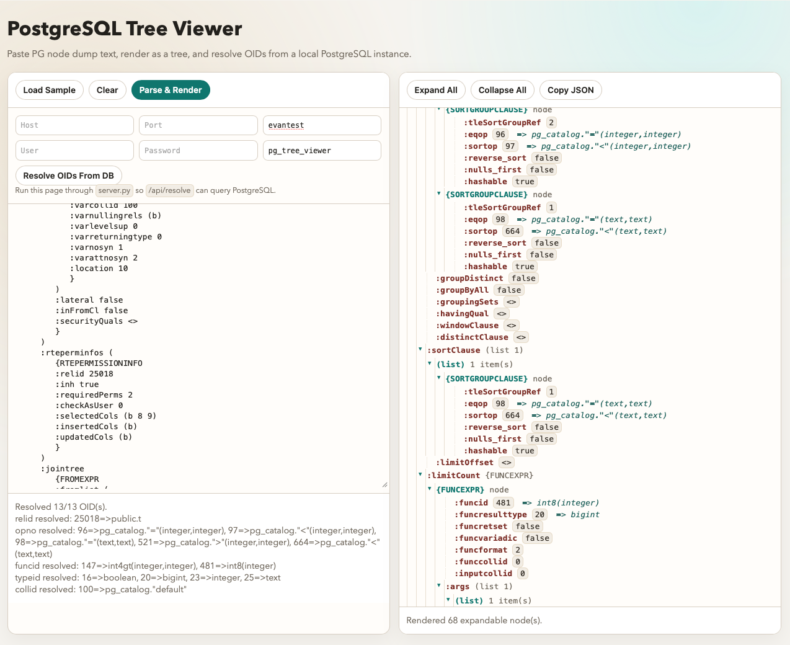

# PostgreSQL Tree Viewer (Experiment)



## Run

```bash
cd experiment
python3 server.py
```

Then open `http://127.0.0.1:8765`.

## Features

- Parse PostgreSQL node dump text (e.g. `{QUERY ...}`) into an expandable tree.
- Resolve OID-like fields from a PostgreSQL database and annotate the tree.
- Supported lookup kinds include relation OIDs, operator OIDs, function OIDs, type OIDs, collation OIDs, and namespace OIDs.

## Connection Inputs

Use the page inputs to set:

- Host
- Port
- Database
- User
- Password
- Application name

The server uses `psql` with `PGHOST`, `PGPORT`, `PGDATABASE`, `PGUSER`, `PGPASSWORD`, and `PGAPPNAME`.

## Notes

- `psql` must be available in `PATH` for OID resolution.
- Unknown OIDs remain unannotated.
